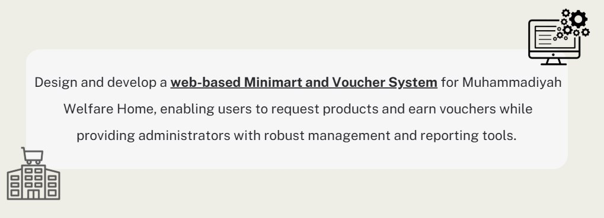
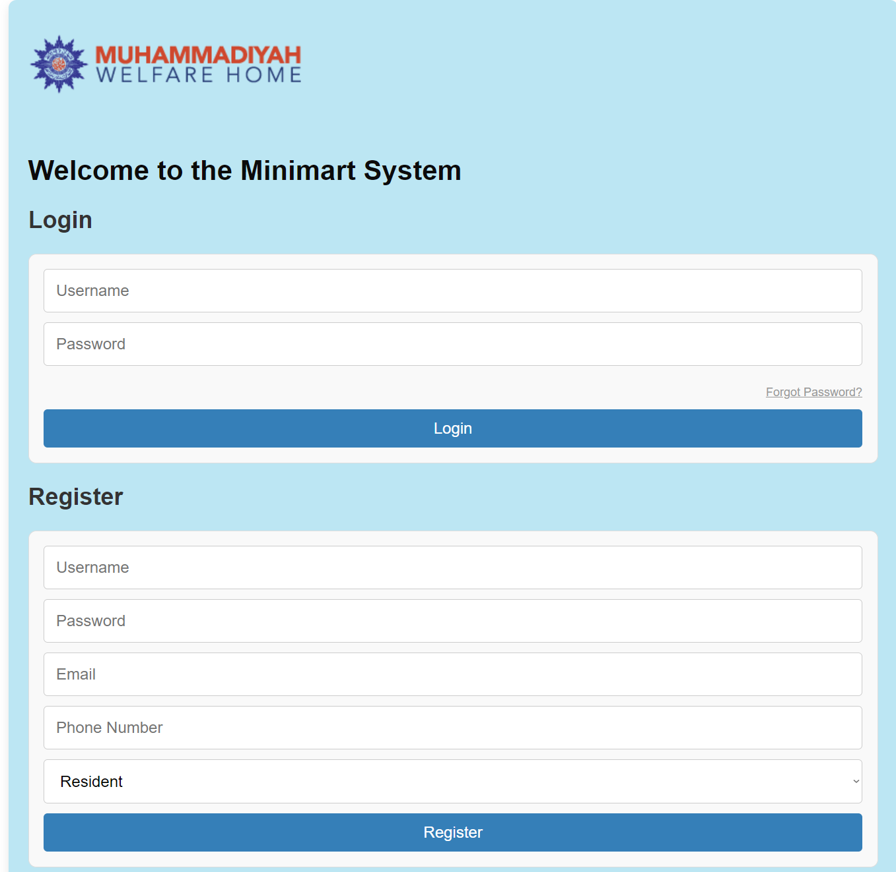
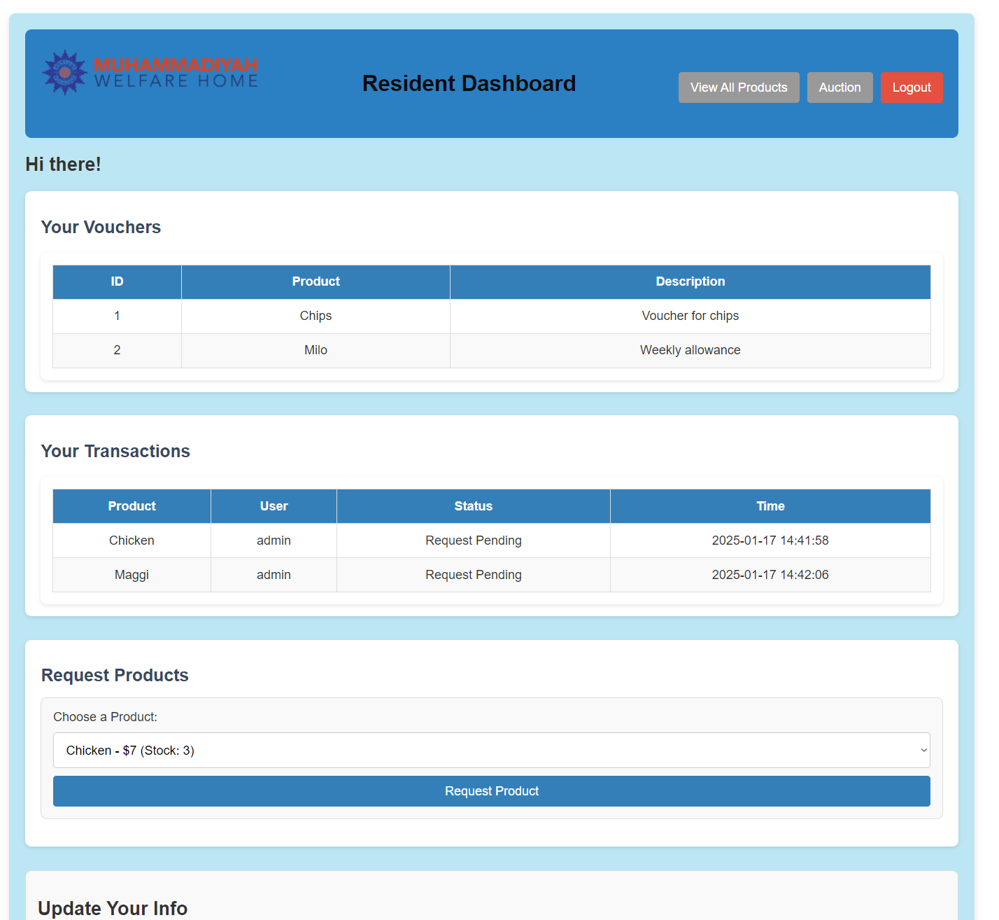
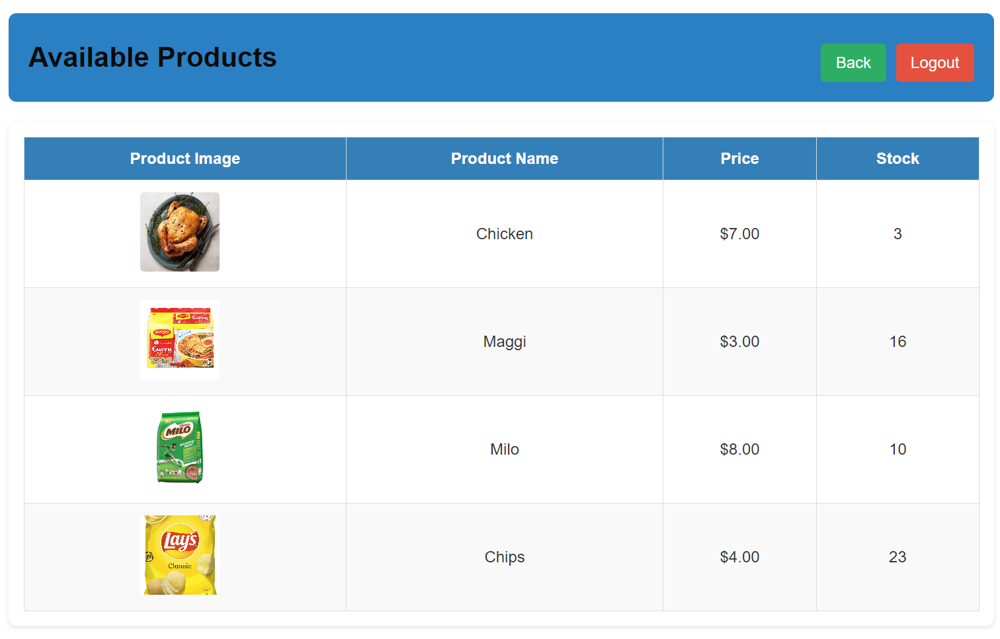
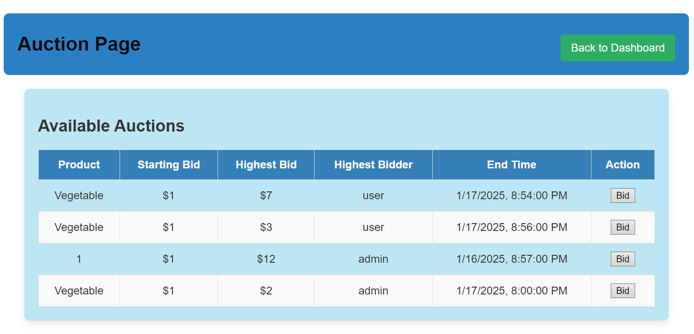
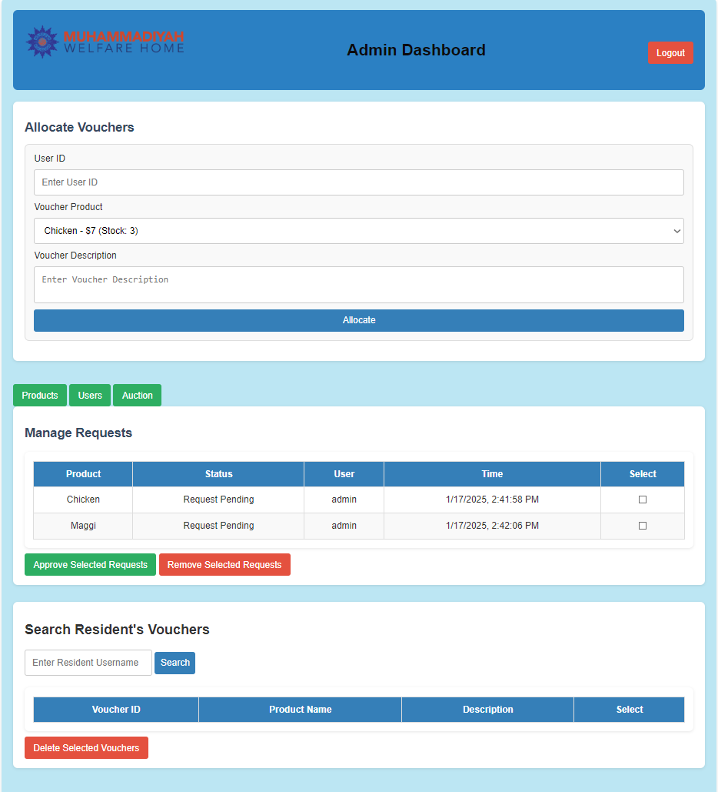
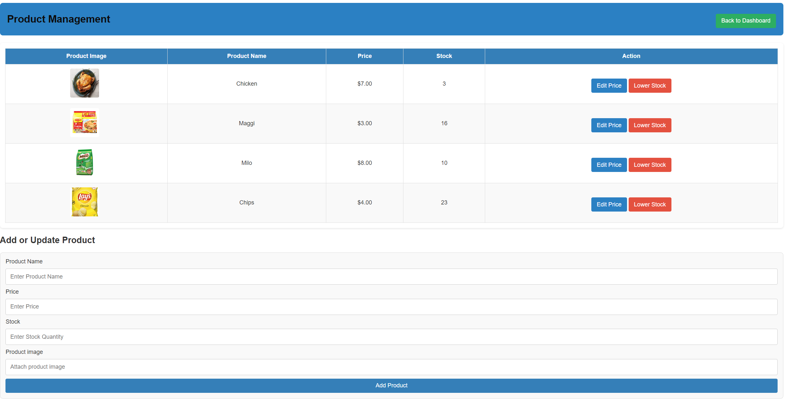
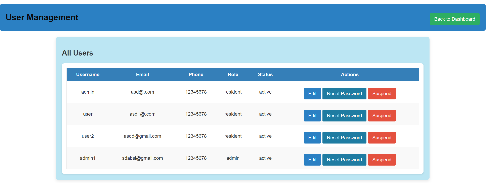
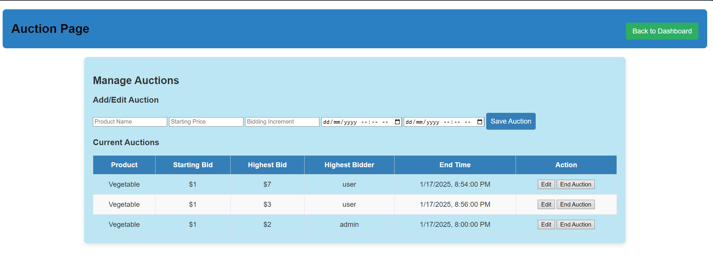

# Minimart website
*submission for H4G 2025*

## Problem statement

## Available features
1) Secure password login system with one way encryption and minimum password requirements (uppercase + lowercase + number + special character)

2) Differentiated roles (Admin vs User)

3) Voucher request management system

4) Product management system

5) Auction system

## User Guide

### Getting started

Installing required dependancies

**Python Version Required: 3.10 or higher**  

`pip install -r requirements.txt`

After installing required packages, both frontend and backend must be run concurrently on separate terminals.

### Running backend
`cd backend`

`python app.py`

### Running frontend
`cd frontend`

`python -m https.server 8000`

### Login page

Register an account by filling in the details and selecting either Resident or Admin for role. Username must be unique and password must contain at least (1 uppercase, 1 lowercase, 1 number and 1 special character)

After account creation, you can log in to view the respective dashboards depending on the role of user.

### Resident Dashboard

This is the resident's dashboard. You can view your allocated vouchers and transaction history. Additionally, you can request for any vouchers for any available items, subject to admin approval. You can also update your account details and navigate to the Products page and Auctions page.

### Products page

### Admin Dashboard

This is the admin's dashboard, you can search for residents, allocate or remove vouchers, approve or reject their requests on this page. You can navigate to user management, product management and auction management webpages.

### Product management

You can add new products, modify prices or change stocks here. Products are identified by their unique names so you won't double count.

### User management

View and edit residents' account information. Allows suspension of users which prevents them from logging in. Reset password allows users to reset their password to default **"12345678"**, allowing them to log in to change their password in events of forgotten password.

### Auction management

Add, modify and end auctions

## Future work

